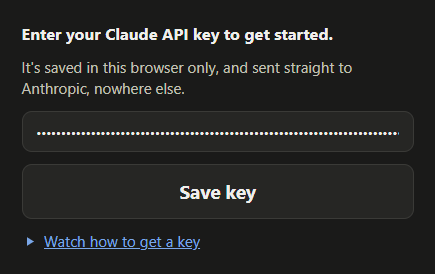
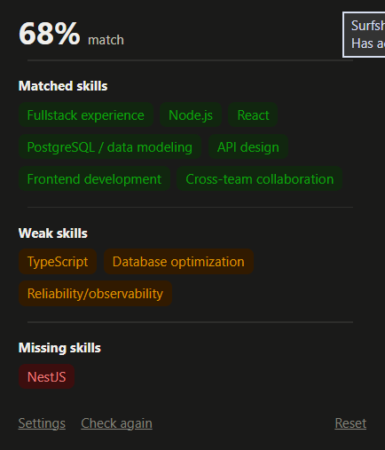
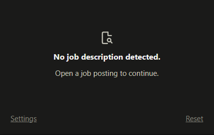

# Resume Match

A browser extension that tells you how well your resume fits the job you're
looking at.

Open a job posting, click the icon, and it reads the posting from the page and
compares it to your resume. You get a match score and three lists: what you
have, what's thin, and what's missing.

## Screenshots

| Setup | A match | No job found |
|---|---|---|
|  |  |  |

## What it costs

Resume Match has no subscription and no account. It runs on your own Anthropic
API key, so you pay Anthropic directly for what you use.

A check costs about **one cent**. Checking several jobs in a row costs less,
because your resume is only sent once and reused for a few minutes. Opening a
job you've already checked costs nothing at all — the result is saved.

Anthropic's smallest credit purchase is $5, which covers several hundred
checks.

## Your data

Everything is stored on your own computer. There is no account, no tracking,
and no server of ours for your data to reach.

When you check a job, your resume and that job's description are sent to
Anthropic to produce the match. Nothing is sent anywhere else. The **Reset**
button erases your saved key, resume, and results.

Full details: [Privacy Policy](PRIVACY.md).

## Installing

The extension isn't in the store yet. To use it now, download this project and
load the folder into your browser:

1. Download this repository and unzip it somewhere you'll keep it. The
   extension runs from this folder, so don't delete it afterwards.
2. Open `edge://extensions` in Edge, or `chrome://extensions` in Chrome.
3. Turn on **Developer mode**.
4. Click **Load unpacked** and select the folder you unzipped.
5. Click the puzzle-piece icon in the toolbar and pin Resume Match so it's
   always visible.

## Getting an API key

You need a key from Anthropic, the company that makes Claude:

1. Go to [console.anthropic.com](https://console.anthropic.com) and create an
   account.
2. Add some credit. The minimum is $5.
3. Open the API keys page and create a key.
4. Copy it and paste it into the extension the first time you open it.

The key is saved on your computer and used only to send your checks to
Anthropic.

## How it works

When you click the icon, the extension reads the job description off the page
you're on. It sends that, along with your resume, to Claude.

Claude goes through the posting one requirement at a time. For each one it
notes what in your resume supports it, then sorts it into matched, weak, or
missing. The score comes last, based on those results.

You can hover over any item to see which requirement it came from and what in
your resume decided it.

Results are saved per job, so reopening a posting you've already checked shows
the answer straight away. **Check again** runs a fresh check.

## Which sites work

**LinkedIn works best.** The extension is built around it and knows exactly
where the description sits on the page. Click between jobs in the list and
open the extension, and it checks whichever job you're looking at — no extra
step.

**Other job sites work too.** Dice and Indeed have both been tested and give
good results, with one thing to know: after moving to a different job on the
same page, press **Check again**. Those sites often keep the same web address
when you switch between postings, so the extension can't tell you've moved and
shows you the previous result. Pressing Check again re-reads the page.

On any site, results are most reliable on a page showing a single job. On a
page listing many jobs side by side, the extension may pick up the wrong one —
open the individual posting first.

If nothing usable is found, the extension says so rather than guessing.

## Project layout

No build step and no dependencies. The files load as they are.

| File | What it does |
|---|---|
| `manifest.json` | Describes the extension to the browser |
| `popup.html` / `style.css` | The window that opens when you click the icon |
| `popup.js` | Decides which screen to show, saves your details, draws results |
| `extractor.js` | Reads the job description off the page |
| `background.js` | Talks to Anthropic and saves the results |
| `vendor/readability.js` | Mozilla's article reader, used to strip page clutter |
| `tools/make_icons.py` | Regenerates the icon files |

To make changes: edit a file, then press reload on the extension's card in the
browser's extensions page. Changes to `manifest.json` always need a reload;
other changes usually just need the window reopened.

## Contributing

Issues and pull requests are welcome. If you want to add support for a job
site, the site rules are the list at the top of `extractor.js` — each entry is
a website and the part of its page that holds the description.

## Licence and credits

Released under the [MIT Licence](LICENSE).

Includes [Readability](https://github.com/mozilla/readability) by Mozilla,
used under the Apache License 2.0.
